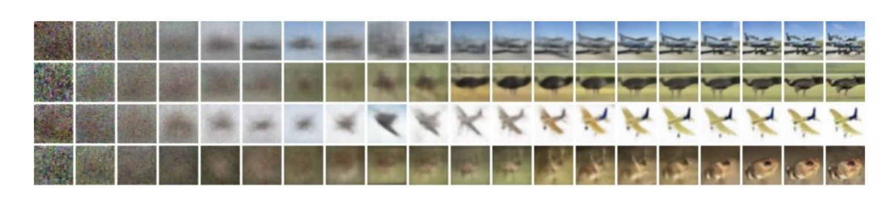

# Denoising Diffusion Probabilistic Models (DDPM)

**Paper:** [Denoising Diffusion Probabilistic Models](https://arxiv.org/abs/2006.11239)  
**Authors:** Jonathan Ho, Ajay Jain, Pieter Abbeel (UC Berkeley)  
**Full Citation:**  
Jonathan Ho, Ajay Jain, and Pieter Abbeel. "Denoising Diffusion Probabilistic Models." *Advances in Neural Information Processing Systems* 33 (2020): 6840-6851.

**Presenter:** Luka Butskhrikidze  
**Course:** DS 5690-01 Gen AI Models in Theory and Practice (2025F)

---

## 📋 Table of Contents
- [Overview](#overview)
- [The Problem](#the-problem)
- [The Approach](#the-approach)
- [Architecture Deep Dive](#architecture-deep-dive)
- [Discussion Questions](#discussion-questions)
- [Critical Analysis](#critical-analysis)
- [Impact & Legacy](#impact--legacy)
- [Code Demonstration](#code-demonstration)
- [Resources](#resources)
- [Citation](#citation)

---

## Overview

**What are Diffusion Models?**

Imagine dropping a single drop of ink into a glass of water. Over time, the ink gradually spreads out until the water becomes uniformly cloudy - this is the **forward diffusion process**. Now imagine if you could *reverse* this process: starting from cloudy water and gradually reconstructing where that original drop was. This is exactly what diffusion models do with images.

**The Core Idea in One Sentence:**  
Learn to reverse a gradual noising process by training a neural network to predict and remove noise at each step.

**Why This Paper Matters:**  
Before DDPM, diffusion models existed but couldn't generate high-quality images. This paper made three key contributions that unlocked their potential:
1. A simplified training objective that actually works
2. Connection to denoising score matching (theoretical justification)
3. Demonstrated that diffusion models can match or exceed GANs in sample quality

**Context (2020):**
- **GANs** dominated image generation but were unstable to train
- **VAEs** were stable but produced blurry images  
- **Autoregressive models** (PixelCNN) were slow
- Diffusion models were theoretically interesting but practically useless

This paper changed everything.

---

## The Problem

### What Problem Does This Paper Address?

**Primary Problem:** How do we generate high-quality, diverse images without the instability of GANs?

**Specific Challenges:**
1. **Training stability** - GANs require careful balancing of generator/discriminator
2. **Mode collapse** - GANs often fail to capture full data diversity
3. **Sample quality vs. likelihood** - VAEs had good likelihoods but poor samples
4. **Speed vs. quality trade-off** - Autoregressive models were slow

### Why Existing Approaches Failed

The paper builds on Sohl-Dickstein et al. (2015) who introduced diffusion models but couldn't make them work:
- Training was unstable
- Generated images were poor quality
- No clear connection to other successful approaches
- Unclear how to parameterize the reverse process

**The Gap:** Theory existed, but no one could make diffusion models actually generate good images.

---

## The Approach

### High-Level Intuition

Think of teaching someone to sculpt:
1. You start with a finished sculpture (real image)
2. Gradually chip away at it (add noise) until it's just a rough block (pure noise)
3. Now teach a student to reverse this: given a rough block, carve it back into the sculpture

The neural network is the student learning to "carve" at each level of roughness.

### Two Processes: Forward and Reverse


*Figure 2 from paper: The directed graphical model showing forward process q (adding noise) and reverse process p_θ (learned denoising)*

#### Forward Process (Fixed, No Learning)
```
x₀ → x₁ → x₂ → ... → xₜ → ... → x_T
(image)              (noisy)      (pure noise)
```

At each step `t`, add a small amount of Gaussian noise:
- Start with real image `x₀`
- At step `t`, we have `xₜ = √(ᾱₜ) x₀ + √(1-ᾱₜ) ε`
  - Where `ε ~ N(0,I)` is random noise
  - `ᾱₜ` is a noise schedule (gets smaller as t increases)
- After T=1000 steps, `x_T` is essentially pure noise `N(0,I)`

**Key Insight:** This process is carefully designed so each step is reversible by a Gaussian distribution.

#### Reverse Process (Learned)
```
x_T → x_{T-1} → ... → x₁ → x₀
(noise)                    (image)
```

The neural network learns to reverse each noising step:
- Input: noisy image `xₜ` and timestep `t`
- Output: prediction of the noise `ε_θ(xₜ, t)`
- Use this to compute `xₜ₋₁` (slightly less noisy)

### The Brilliant Parameterization Choice

**This is the paper's key insight!**

Instead of predicting the clean image `x₀` or the mean of the reverse distribution `μ`, predict **the noise itself** `ε`.

Why? Because at any timestep `t`:
```
xₜ = √(ᾱₜ) x₀ + √(1-ᾱₜ) ε
```

If we know `ε`, we can estimate `x₀`:
```
x₀ ≈ (xₜ - √(1-ᾱₜ) ε_θ(xₜ,t)) / √(ᾱₜ)
```

This parameterization connects diffusion models to **denoising score matching** and makes training much more stable.

### Visual Example: Progressive Generation


*Figure 6 from paper: Watching images emerge from noise. Left to right shows the reverse diffusion process, with large-scale features appearing first and fine details appearing last.*

## Discussion Questions

### Question 1: Why Start From Pure Noise?

**Setup:** Look at the progressive generation image above. The diffusion model starts sampling from complete random noise (x_T) and gradually denoises it to create an image.

**Question for the class:**  
*Why do you think diffusion models start generation from pure random noise instead of, say, a blurry average image or a blank canvas? What advantage does starting from noise give us?*

**Think about:**
- Diversity of generated images
- What does noise represent in terms of possibilities?

<details>
<summary><b>Answer </b></summary>

**Key Insight:** Pure noise represents *maximum uncertainty* - all possible images are equally likely!

**Benefits:**

1. **Maximum diversity:** Every noise sample can become a completely different image. If we started from a fixed template (like a blurry average), we'd get less diverse outputs.

2. **Mirrors the training process:** During training, we corrupt images all the way to pure noise. To reverse this perfectly, we need to start from the same distribution.

3. **No mode collapse:** Unlike GANs which can get "stuck" generating similar images, diffusion models explore the full space of possibilities because each noise sample is unique.

4. **Mathematical elegance:** The forward process ends at N(0,I), so the reverse process naturally starts there.

**Analogy:** Think of noise as having *all* possible images superimposed. The denoising process gradually "collapses" this into one specific image, like a quantum wavefunction collapse!

</details>

### Question 2: What Appears First During Generation?

**Question for the class:**  
*Look at the progressive generation image (Figure 6 above). As the model denoises from left to right, what kinds of features appear first vs. last? Why does this order make sense?*

**Observe:**
- What can you see at t=750 vs t=250 vs t=0?
- Which is harder to predict: "this is a face" or "this person has a freckle on their left cheek"?

<details>
<summary><b>Answer </b></summary>

**Observed Pattern:**
- **Early steps (t=999→750):** Overall structure, layout, general composition
- **Middle steps (t=500):** Object shapes, rough colors, major features  
- **Late steps (t=250→0):** Fine details, textures, sharp edges

**Why This Order?**

1. **Coarse-to-fine is easier:** It's easier to predict "there's a face here" when you have rough shapes than when you have pure noise. The model builds a scaffolding first.

2. **Information hierarchy:** 
   - Large-scale structure (composition, pose) carries more information
   - Fine details (individual hair strands, skin texture) are less critical
   - Makes sense to get the important stuff right first!

3. **Like human artists:** Painters also work coarse-to-fine:
   - Sketch rough composition
   - Block in major shapes and colors
   - Add details and refinement last

4. **Mathematical reason:** The noise schedule is designed this way! Early steps remove large-scale noise (affects overall structure), later steps remove fine-scale noise (affects details).

**Cool insight:** This is fundamentally different from autoregressive models (like PixelCNN) which generate pixel-by-pixel in raster order. Diffusion's coarse-to-fine generation is more natural for images!

</details>

---

### The Simplified Training Objective

Instead of the complex variational bound, the paper uses:

```
L_simple = E_t,x₀,ε [ ‖ε - ε_θ(√(ᾱₜ)x₀ + √(1-ᾱₜ)ε, t)‖² ]
```

In plain English:
1. Take a real image `x₀`
2. Sample a random timestep `t`
3. Add noise `ε` to get `xₜ`
4. Train the network to predict that noise
5. Compute MSE loss

**That's it!** Remarkably simple.

---

## Architecture Deep Dive

### Training Algorithm (Pseudocode)

```python
# Algorithm 1: Training
repeat until converged:
    # Sample a real image from dataset
    x₀ ~ q(x₀)
    
    # Sample random timestep
    t ~ Uniform({1, ..., T})
    
    # Sample random noise
    ε ~ N(0, I)
    
    # Create noisy image
    xₜ = √(ᾱₜ) * x₀ + √(1-ᾱₜ) * ε
    
    # Gradient descent on:
    ∇_θ ‖ε - ε_θ(xₜ, t)‖²
```

**Key Points:**
- Each training step is independent (can train in parallel)
- Only need to predict noise, not the full distribution
- Timestep `t` tells the network "how noisy is this?"

### Sampling Algorithm (Pseudocode)

```python
# Algorithm 2: Sampling
# Start from pure noise
x_T ~ N(0, I)

# Gradually denoise
for t = T, T-1, ..., 1:
    # Sample noise for stochasticity (except last step)
    z ~ N(0, I) if t > 1 else z = 0
    
    # Predict the noise
    ε_pred = ε_θ(xₜ, t)
    
    # Compute less noisy image
    xₜ₋₁ = (1/√αₜ) * (xₜ - ((1-αₜ)/√(1-ᾱₜ)) * ε_pred) + σₜ * z

return x₀  # Final denoised image
```

**Key Points:**
- Requires T=1000 forward passes (slow!)
- Each step removes a little noise
- Process is stochastic (adds small noise z) for diversity

### Network Architecture

The paper uses a **U-Net** backbone (common in image segmentation):


*U-Net architecture used in DDPM. Green blocks are downsampling layers, blue blocks handle both up and downsampling, with skip connections (dotted lines) connecting encoder to decoder at each resolution.*

```
Input: xₜ (noisy image) + t (timestep embedding)
       ↓
    Encoder (downsampling)
       ↓
    [32×32] → [16×16] → [8×8] → [4×4]
       ↓
    Self-Attention at 16×16 resolution
       ↓
    Decoder (upsampling with skip connections)
       ↓
Output: ε_θ (predicted noise, same shape as xₜ)
```

**Architecture Choices:**
- **Group Normalization** (not Batch Norm) for stability
- **Sinusoidal position embeddings** for timestep `t` (like Transformers!)
- **Self-attention** at 16×16 to capture global structure
- **Skip connections** from encoder to decoder (U-Net style)
- **35.7M parameters** for CIFAR10, **114M** for 256×256 images

**Timestep Conditioning:**  
The timestep `t` is crucial - it tells the network "how noisy is this image?" The sinusoidal embedding is added to each residual block.

### Comparison to Other Architectures

| Model Type | Architecture | Sampling Speed | Training Stability |
|------------|--------------|----------------|-------------------|
| **GAN** | Generator + Discriminator | ⚡ Fast (1 step) | ⚠️ Unstable |
| **VAE** | Encoder + Decoder | ⚡ Fast (1 step) | ✅ Stable |
| **Autoregressive** | Transformer/PixelCNN | 🐌 Slow (N pixels) | ✅ Stable |
| **DDPM** | U-Net (noise predictor) | 🐌 Very Slow (1000 steps) | ✅ Very Stable |

---

## Critical Analysis

### What This Paper Got Right ✅

1. **Simplification over theory:** The variational bound is complex, but L_simple is elegant. Sometimes ignoring proper weighting works better!

2. **Connecting multiple fields:** Links diffusion models, score matching, Langevin dynamics, and variational inference

3. **Reproducible results:** Released code, clear algorithm, works on multiple datasets

### Three Main Limitations ⚠️

#### 1. **Extremely Slow Sampling**
- Requires 1000 neural network evaluations per image
- CIFAR10: ~17 seconds vs GANs at ~0.01 seconds
- Limited real-time applications
- Later work (DDIM, 2021) reduced this to 50 steps

#### 2. **Poor Log-Likelihood Despite Good Samples**
- Worse bits/dim than PixelCNN (3.75 vs 3.03)
- Most bits encode imperceptible details
- Raises question: Is likelihood the right metric?

#### 3. **Lack of Controllability**
- Only demonstrates unconditional generation
- No built-in way to condition on text, class labels, or attributes
- Later work added classifier guidance and classifier-free guidance

---

## Impact & Legacy

### The Lineage to Modern AI

This paper sparked an explosion of research that led directly to today's image generation systems:

```
DDPM (2020)
    ↓
Improved DDPM (2021)
    ↓
GLIDE (2021) - Text-conditional diffusion
    ↓
    ├→ DALL-E 2 (2022)
    ├→ Imagen (2022)
    └→ Stable Diffusion (2022)
        ↓
    Midjourney, Adobe Firefly, etc.
```

### Applications Beyond Images

Diffusion models have expanded far beyond image generation:

**Protein Science & Drug Discovery:**
- Novel protein structure generation
- Protein-protein binding design
- Antibody design for therapeutics
- Molecular conformation sampling
- Drug molecule generation

**Other Domains:**
- Medical imaging (MRI reconstruction, CT denoising)
- Video generation
- Audio and speech synthesis
- 3D shape generation
- Motion planning for robotics
- Weather prediction and climate modeling

The same core algorithm (predict noise, reverse the process) works across all these domains with appropriate modifications.

### Why Diffusion Models Won

**Compared to GANs:** More stable training, better diversity, but slower sampling  
**Compared to VAEs:** Much better sample quality, but worse likelihood  
**Compared to Autoregressive:** Better for images, parallelizable training, but still slow sampling

Diffusion models found the sweet spot: stable, high-quality, and theoretically grounded.

---

## Code Demonstration

### Minimal DDPM Implementation

This demonstration shows the core of DDPM: how noise is gradually added (forward) and removed (reverse).

```python
"""
Minimal Denoising Diffusion Probabilistic Model (DDPM)
Demonstrates the forward noising and reverse denoising processes
"""

import numpy as np
import matplotlib.pyplot as plt
from typing import Tuple

class SimpleDDPM:
    """
    Simplified DDPM for visualization purposes.
    In practice, you'd use a U-Net instead of this toy predictor.
    """
    
    def __init__(self, num_timesteps: int = 1000):
        self.T = num_timesteps
        
        # Linear beta schedule (as in the paper)
        self.betas = np.linspace(1e-4, 0.02, num_timesteps)
        
        # Precompute useful values
        self.alphas = 1.0 - self.betas
        self.alphas_cumprod = np.cumprod(self.alphas)
        self.sqrt_alphas_cumprod = np.sqrt(self.alphas_cumprod)
        self.sqrt_one_minus_alphas_cumprod = np.sqrt(1.0 - self.alphas_cumprod)
        
    def forward_diffusion(self, x0: np.ndarray, t: int) -> Tuple[np.ndarray, np.ndarray]:
        """
        Forward diffusion: add noise to x0 at timestep t
        
        x_t = sqrt(alpha_bar_t) * x0 + sqrt(1 - alpha_bar_t) * epsilon
        
        Args:
            x0: Original data (e.g., image)
            t: Timestep (0 to T-1)
            
        Returns:
            x_t: Noised data at timestep t
            epsilon: The noise that was added
        """
        # Sample noise
        epsilon = np.random.randn(*x0.shape)
        
        # Get noise schedule values for timestep t
        sqrt_alpha_bar_t = self.sqrt_alphas_cumprod[t]
        sqrt_one_minus_alpha_bar_t = self.sqrt_one_minus_alphas_cumprod[t]
        
        # Apply forward diffusion formula
        x_t = sqrt_alpha_bar_t * x0 + sqrt_one_minus_alpha_bar_t * epsilon
        
        return x_t, epsilon
    
    def reverse_diffusion_step(self, x_t: np.ndarray, t: int, epsilon_pred: np.ndarray) -> np.ndarray:
        """
        Single step of reverse diffusion (denoising)
        
        This is Algorithm 2 from the paper (simplified).
        In practice, epsilon_pred comes from a neural network.
        
        Args:
            x_t: Noisy data at timestep t
            t: Current timestep
            epsilon_pred: Predicted noise (from neural network)
            
        Returns:
            x_{t-1}: Less noisy data at timestep t-1
        """
        if t == 0:
            # Final step: just compute mean
            alpha_bar_t = self.alphas_cumprod[t]
            return (x_t - np.sqrt(1 - alpha_bar_t) * epsilon_pred) / np.sqrt(alpha_bar_t)
        
        # Get values for timestep t
        alpha_t = self.alphas[t]
        alpha_bar_t = self.alphas_cumprod[t]
        beta_t = self.betas[t]
        
        # Compute mean of reverse distribution
        coef1 = 1.0 / np.sqrt(alpha_t)
        coef2 = beta_t / np.sqrt(1.0 - alpha_bar_t)
        mean = coef1 * (x_t - coef2 * epsilon_pred)
        
        # Add noise for stochasticity (except last step)
        sigma_t = np.sqrt(beta_t)
        z = np.random.randn(*x_t.shape)
        
        x_t_minus_1 = mean + sigma_t * z
        
        return x_t_minus_1


def visualize_forward_process(ddpm: SimpleDDPM, x0: np.ndarray, timesteps_to_show: list):
    """
    Visualize how an image gets progressively noisier
    """
    fig, axes = plt.subplots(1, len(timesteps_to_show), figsize=(15, 3))
    
    for idx, t in enumerate(timesteps_to_show):
        x_t, _ = ddpm.forward_diffusion(x0, t)
        
        # Clip for visualization
        x_t_vis = np.clip(x_t, 0, 1)
        
        axes[idx].imshow(x_t_vis, cmap='gray')
        axes[idx].set_title(f't = {t}')
        axes[idx].axis('off')
    
    plt.suptitle('Forward Process: Progressive Noising', fontsize=14)
    plt.tight_layout()
    return fig


def visualize_reverse_process(ddpm: SimpleDDPM, timesteps_to_show: list):
    """
    Visualize reverse process with a toy noise predictor.
    
    Note: This uses a VERY simplified noise predictor (just scaling).
    Real DDPM uses a trained U-Net.
    """
    # Start from pure noise
    x_t = np.random.randn(28, 28)
    
    fig, axes = plt.subplots(1, len(timesteps_to_show), figsize=(15, 3))
    
    sample_idx = 0
    for t in range(ddpm.T - 1, -1, -1):
        # Toy noise predictor (in reality, this is a trained U-Net)
        # For visualization, we just use a simple heuristic
        epsilon_pred = x_t * 0.1  # Simplified!
        
        # Take reverse diffusion step
        x_t = ddpm.reverse_diffusion_step(x_t, t, epsilon_pred)
        
        # Save frames at specific timesteps
        if t in timesteps_to_show:
            x_t_vis = np.clip(x_t, 0, 1)
            axes[sample_idx].imshow(x_t_vis, cmap='gray')
            axes[sample_idx].set_title(f't = {t}')
            axes[sample_idx].axis('off')
            sample_idx += 1
    
    plt.suptitle('Reverse Process: Progressive Denoising (Toy Example)', fontsize=14)
    plt.tight_layout()
    return fig


def plot_noise_schedule(ddpm: SimpleDDPM):
    """
    Visualize the noise schedule over time
    """
    fig, axes = plt.subplots(1, 2, figsize=(12, 4))
    
    # Beta schedule
    axes[0].plot(ddpm.betas)
    axes[0].set_xlabel('Timestep t')
    axes[0].set_ylabel('β_t')
    axes[0].set_title('Noise Schedule: β_t (amount of noise added per step)')
    axes[0].grid(True, alpha=0.3)
    
    # Cumulative alpha (signal retention)
    axes[1].plot(ddpm.alphas_cumprod)
    axes[1].set_xlabel('Timestep t')
    axes[1].set_ylabel('ᾱ_t')
    axes[1].set_title('Cumulative Signal: ᾱ_t (how much original signal remains)')
    axes[1].grid(True, alpha=0.3)
    
    plt.tight_layout()
    return fig


# ============================================
# Example Usage
# ============================================

if __name__ == "__main__":
    # Initialize DDPM
    ddpm = SimpleDDPM(num_timesteps=1000)
    
    # Create a simple synthetic image (checkerboard pattern)
    x0 = np.zeros((28, 28))
    x0[::4, ::4] = 1.0  # Checkerboard
    x0[2::4, 2::4] = 1.0
    
    print("=" * 60)
    print("DDPM Demonstration")
    print("=" * 60)
    print(f"Number of timesteps: {ddpm.T}")
    print(f"Beta range: {ddpm.betas[0]:.6f} to {ddpm.betas[-1]:.6f}")
    print(f"Final alpha_bar (signal at t=T): {ddpm.alphas_cumprod[-1]:.6e}")
    print("=" * 60)
    
    # Visualize forward process
    print("\n1. Visualizing forward diffusion (adding noise)...")
    timesteps_forward = [0, 100, 250, 500, 750, 999]
    fig1 = visualize_forward_process(ddpm, x0, timesteps_forward)
    plt.savefig('forward_process.png', dpi=150, bbox_inches='tight')
    print("   Saved: forward_process.png")
    
    # Visualize noise schedule
    print("\n2. Visualizing noise schedule...")
    fig2 = plot_noise_schedule(ddpm)
    plt.savefig('noise_schedule.png', dpi=150, bbox_inches='tight')
    print("   Saved: noise_schedule.png")
    
    # Visualize reverse process (toy example)
    print("\n3. Visualizing reverse diffusion (toy example)...")
    print("   Note: This uses a simplified noise predictor.")
    print("   Real DDPM uses a trained U-Net.")
    timesteps_reverse = [999, 750, 500, 250, 100, 0]
    fig3 = visualize_reverse_process(ddpm, timesteps_reverse)
    plt.savefig('reverse_process.png', dpi=150, bbox_inches='tight')
    print("   Saved: reverse_process.png")
    
    print("\n" + "=" * 60)
    print("Key Takeaways:")
    print("=" * 60)
    print("• Forward process: Gradually adds Gaussian noise over T steps")
    print("• At t=999, the image is almost pure noise")
    print("• Reverse process: Neural network learns to predict and remove noise")
    print("• Training: Minimize ||ε - ε_θ(x_t, t)||²")
    print("• Sampling: Start from noise, denoise for T steps")
    print("=" * 60)
    
    plt.show()
```

### What This Code Demonstrates

1. **Forward Process:**
   - Shows how an image gradually becomes noise
   - Implements the formula: `x_t = √(ᾱ_t) x_0 + √(1-ᾱ_t) ε`

2. **Reverse Process:**
   - Shows how noise gradually becomes an image
   - Uses a toy noise predictor (real DDPM trains a U-Net)

3. **Noise Schedule:**
   - Visualizes β_t (noise added per step)
   - Visualizes ᾱ_t (signal remaining)

**To run:**
```bash
python ddpm_demo.py
```

This will generate three visualizations showing the core DDPM mechanics.

---

## Resources

### Essential Links

1. **[Original Paper (arXiv)](https://arxiv.org/abs/2006.11239)**  
   The full paper with all mathematical derivations

2. **[Official Implementation (GitHub)](https://github.com/hojonathanho/diffusion)**  
   TensorFlow code from the authors

3. **[Annotated Paper (Hugging Face)](https://huggingface.co/blog/annotated-diffusion)**  
   Line-by-line walkthrough with PyTorch implementation

4. **[Lilian Weng's Blog Post](https://lilianweng.github.io/posts/2021-07-11-diffusion-models/)**  
   Excellent intuitive explanation of diffusion models

5. **[The Illustrated Stable Diffusion (Jay Alammar)](https://jalammar.github.io/illustrated-stable-diffusion/)**  
   Visual guide to diffusion models and their applications

### Additional Resources

- **Score-Based Models:** [Yang Song's blog](https://yang-song.net/blog/2021/score/)
- **Diffusion Tutorial:** [Hugging Face Course](https://huggingface.co/docs/diffusers/index)
- **Video Lecture:** [Pieter Abbeel on Diffusion Models](https://www.youtube.com/watch?v=fbLgFrlTnGU)

---

## Citation

```bibtex
@inproceedings{ho2020denoising,
  title={Denoising Diffusion Probabilistic Models},
  author={Ho, Jonathan and Jain, Ajay and Abbeel, Pieter},
  booktitle={Advances in Neural Information Processing Systems},
  volume={33},
  pages={6840--6851},
  year={2020}
}
```

**Full Citation:**  
Jonathan Ho, Ajay Jain, and Pieter Abbeel. "Denoising Diffusion Probabilistic Models." *Advances in Neural Information Processing Systems* 33 (2020): 6840-6851.

---

## Acknowledgments

This presentation was prepared for DS 5690-01 Gen AI Models in Theory and Practice (2025F). Special thanks to the course instructors and the original paper authors for their groundbreaking work that revolutionized generative modeling.

---

**Repository Structure:**
```
.
├── README.md (this file)
├── ddpm_demo.py (code demonstration)
├── forward_process.png 
├── reverse_process.png 
└── noise_schedule.png 
```
